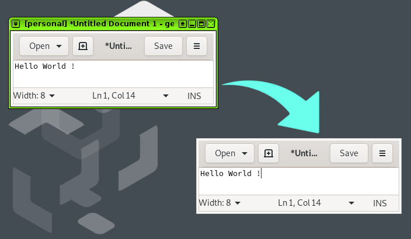

# qubes-screenshooter
LeakProof screenshot tool for [Qubes OS]



## Features
* Remove [EXIF] info from image (**OPSEC**)
* Automatically strip window borders, to prevent leaking VM name and border color (**OPSEC**)
* Detect active window VM, and save screenshot on this VM
* Save image into `~/QubesIncomming/dom0/` on target VM
* Copy image into target VM clipboard, so a simple `Ctrl+V` in rich text editors is enough


## Usage
#### **`Print`** shortcut:
_Take screenshot of active window_
1. Take screenshot of current active window (foreground)
2. Remove [EXIF] info from image (**OPSEC**)
3. Strip window border, to prevent leaking VM name and border color (**OPSEC**)
4. Save it into active window's VM (e.g: if window is from `vault` VM, screenshot is automatically saved in this VM

#### **`Ctrl`+`Print`** shortcut:
_Take screenshot of selected region_
  1. Select a region to be captured by clicking a point of the screen
  2. Remove [EXIF] info from image (**OPSEC**)
  3. Prompt user a list of running VMs
  4. Save image into chosen VM


## Installation:
In a terminal on `<src-vm>` (any Qube with internet access):
```sh
# download qubes-screenshooter as zip
wget github.com/nil0x42/qubes-screenshooter/archive/master.zip -O /tmp/qubes-screenshooter.zip
```

In a terminal on `dom0`:
```sh
# open root shell, to be able to write to /opt (otherwise, you can copy to another location)
sudo -s
# copy zip file from <src-vm> to dom0's /opt directory
qvm-run --pass-io <src-vm> 'cat /tmp/qubes-screenshooter.zip' > qubes-screenshooter.zip
unzip qubes-screenshooter.zip
mv "qubes-screenshooter-master/" /opt
```

Open **Keyboard Settings** *(on Qubes OS GUI)*:
> * Click on **Main Menu** *(top-left Qubes OS icon)*
>   * Select **System Tools**
>     * Select **Keyboard**
>       * Open **Application Shortcuts** tab
* Add the following shortcuts:
  * **`Print`**
    * `xfce4-screenshooter -m -w -o /opt/qubes-screenshooter/send-screenshot-to-active-vm`
  * **`Ctrl`+`Print`**
    * `xfce4-screenshooter -r -o /opt/qubes-screenshooter/send-screenshot-to-chosen-vm`


## Dependencies & Third-party tools

[qubes-screenshooter] must run on `dom0` to be able to take screenshots, because GUI runs on `dom0`.

qubes-screenshooter is basically a set of 2 **perl** scripts, making use of many pre-installed tools:
* `xfce4-screenshooter` is the default xfce screenshot tool.
  It is the actual tool used to take screenshots, before giving ownership to [qubes-screenshooter].
* `ImageMagick` (provides `mogrify`), allows stripping [EXIF] info & window borders from image before sending screenshot.
* `zenity` is used to display VM choice GTK+ dialog
* `notify-send` is used to display notification of sent screenshot

**IMPORTANT:
> The `copy image to cpipboard` feature depends on `xclip` being installed on target VMs.
> So you should install it on all VMs if you want it working**

[Qubes OS]: https://www.qubes-os.org/
[EXIF]: https://en.wikipedia.org/wiki/Exif
[qubes-screenshooter]: https://github/com/nil0x42/qubes-screenshooter
